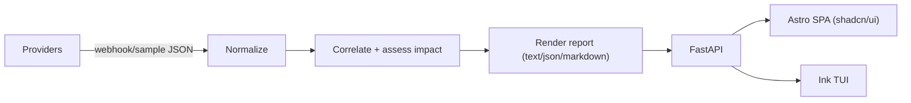

# aiTriage

Portfolio project: ingest alerts (Prometheus / Datadog / BetterStack), correlate signals (saturation + errors + latency), and generate a concise situation report + suggested runbook steps.

> Key behavior: **high saturation alone is not necessarily an incident** if latency and errors stay normal.

## Repo layout

- `backend/` — FastAPI backend (ingest, correlate, report)
- `frontend/` — Astro SPA (React + Tailwind + shadcn/ui)
- `cli/` — Ink-based TUI (k9s-like)
- `samples/` — sample provider payloads + demo scenarios
- `skills/` — reusable SRE Skill for observability-aware agents

## Architecture (high level)



## Quickstart

### 1) Backend (FastAPI)

```bash
cd backend
cp .env.example .env
uv venv
source .venv/bin/activate
uv pip install -r requirements.txt -r requirements-dev.txt
uvicorn app.main:app --reload --port 8000
```

### 2) Frontend (Astro SPA)

```bash
bun install
cp frontend/.env.example frontend/.env
bun run frontend:dev
```

### 3) CLI (Ink TUI)

```bash
# Help
bun run --cwd cli dev -- --help

# Launch TUI
bun run --cwd cli dev -- tui --api http://localhost:8000

# Run demo scenarios
bun run --cwd cli dev -- demo saturation_only --api http://localhost:8000
bun run --cwd cli dev -- demo full_outage --api http://localhost:8000
```

### 4) Report Caching & Rate Limiting (SQLite3)

The backend uses SQLite3 for two purposes:

**Report Caching**: Caches LLM-generated reports to avoid duplicate API calls when switching between formats (markdown/text/json). The cache database is automatically created at `backend/cache.db` (or a custom path via `CACHE_DB_DIR` environment variable).

**Rate Limiting**: Enforces a limit of **3 LLM API calls per hour per IP address** (shared across OpenAI and Anthropic). The rate limit database is stored at `backend/rate_limit.db` in the same directory as the cache.

**Key behaviors:**
- Cached reports don't count toward the rate limit
- Rate-limited requests to the report endpoint fall back to deterministic output (no error)
- Rate-limited requests to the chat endpoint return `429 Too Many Requests`
- Rate limit headers (`X-RateLimit-Limit`, `X-RateLimit-Remaining`) are included in responses
- Use `/api/admin/unblock-ip?ip_address={ip}` to reset rate limits for an IP

**Note**: If SQLite is unavailable, the backend gracefully falls back to generating reports on-demand (no caching) and allows all requests (no rate limiting). Reports are automatically invalidated when incidents are updated (new alerts, resolution changes).

## Demo scenarios

- `saturation_only`: saturation is critical, **but latency and errors are normal** ⇒ **impact = none**, classification `capacity_warning`.
- `full_outage`: errors + latency are critical (and saturation is high) ⇒ **impact = major**.

You can run them via the API:

```bash
curl -X POST http://localhost:8000/api/scenarios/saturation_only
curl -X POST http://localhost:8000/api/scenarios/full_outage
```

Or ingest a scenario bundle from `samples/`:

```bash
bun run --cwd cli dev -- ingest --file samples/scenarios/saturation_only.json --api http://localhost:8000
```

## API endpoints (MVP)

- `POST /api/ingest` — normalize + correlate provider payloads
- `GET /api/incidents` — list incidents
- `GET /api/incidents/{id}` — incident detail
- `POST /api/incidents/{id}/report?format=text|markdown|json&llm=auto|off|openai|anthropic` — generate report
- `POST /api/scenarios/{scenario}` — inject sample scenario
- `GET /api/stream` — SSE stream (`incident_updated`, `alert_ingested`)
- `GET /openapi.json` — OpenAPI 3.1 schema (Swagger compatible)
- `GET /docs` — Swagger UI (served by FastAPI)
- `POST /api/chat` — free-form SRE chat (metrics/logs/deployment Q&A)
- `POST /api/admin/unblock-ip?ip_address={ip}` — unblock/reset rate limit for an IP address

## API examples

Assuming the backend is running on `http://localhost:8000`.

### Generate a situation report (cURL)

```bash
INCIDENT_ID="your-incident-id"

curl -X POST \
  "http://localhost:8000/api/incidents/${INCIDENT_ID}/report?format=markdown&llm=auto" \
  -H "Content-Type: application/json"
```

### Ask the SRE chat endpoint (cURL)

```bash
curl -X POST http://localhost:8000/api/chat \
  -H "Content-Type: application/json" \
  -d @- << 'EOF'
{
  "prompt": "Here are the metrics from my API service:\n- p95 latency: 340ms (baseline: 180ms)\n- Error rate: 1.2%\n- CPU: 85%\n- Memory: 72%\n\nShould I be concerned?"
}
EOF
```

### Unblock an IP address (Admin)

```bash
curl -X POST "http://localhost:8000/api/admin/unblock-ip?ip_address=192.168.1.100"
```

### JavaScript / TypeScript (fetch)

```ts
const BASE = "http://localhost:8000";

async function getIncidents() {
  const res = await fetch(`${BASE}/api/incidents`);
  if (!res.ok) throw new Error(`HTTP ${res.status}`);
  return await res.json();
}

async function chatSre(prompt: string) {
  const res = await fetch(`${BASE}/api/chat`, {
    method: "POST",
    headers: { "content-type": "application/json" },
    body: JSON.stringify({ prompt }),
  });
  if (!res.ok) throw new Error(`HTTP ${res.status}`);
  return await res.text();
}
```

### Python (requests)

```python
import requests

BASE = "http://localhost:8000"

def list_incidents():
    r = requests.get(f"{BASE}/api/incidents")
    r.raise_for_status()
    return r.json()

def generate_report(incident_id: str, fmt: str = "markdown"):
    r = requests.post(
        f"{BASE}/api/incidents/{incident_id}/report",
        params={"format": fmt, "llm": "auto"},
    )
    r.raise_for_status()
    return r.text
```

### Go (net/http)

```go
package main

import (
	"fmt"
	"io"
	"net/http"
)

func main() {
	base := "http://localhost:8000"

	resp, err := http.Get(base + "/api/incidents")
	if err != nil {
		panic(err)
	}
	defer resp.Body.Close()

	body, err := io.ReadAll(resp.Body)
	if err != nil {
		panic(err)
	}

	fmt.Println(string(body))
}
```

## Optional LLM support

The report endpoint can optionally use an LLM for a nicer narrative. It always falls back to deterministic output.

- **Where to put keys**: copy `backend/.env.example` → `backend/.env` and fill in secrets (the file is gitignored), or export env vars in your shell.
- **OpenAI**: `OPENAI_API_KEY` (optional `AITRIAGE_OPENAI_MODEL`)
- **Anthropic**: `ANTHROPIC_API_KEY` (optional `AITRIAGE_ANTHROPIC_MODEL`, defaults to `claude-sonnet-4-5-20250929`)
- **Optional default**: `AITRIAGE_LLM_PROVIDER=openai|anthropic`

**Rate Limiting**: LLM API calls are rate-limited to **3 requests per hour per IP address** (shared across OpenAI and Anthropic). Cached reports don't count toward the limit. See the [Report Caching & Rate Limiting](#4-report-caching--rate-limiting-sqlite3) section for details.

> Want your SRE assistant or LLM to reason about observability data even better? Check out the bundled SRE Skill in [`skills/README.md`](skills/README.md).

## Deployment (fly.io)

### Prerequisites
- Install [flyctl](https://fly.io/docs/hands-on/install-flyctl/)
- Sign up/login: `fly auth login`

### Deploy

```bash
# 1. Create a new fly.io app (first time only)
fly launch --no-deploy

# 2. Set secrets (LLM API keys)
fly secrets set OPENAI_API_KEY=your_key_here
# or
fly secrets set ANTHROPIC_API_KEY=your_key_here

# 3. Deploy
fly deploy

# 4. Open in browser
fly open
```

### Configuration

The `Dockerfile` uses a multi-stage build:
1. **Stage 1 (Bun)**: builds the Astro frontend into `frontend/dist/`
2. **Stage 2 (Python)**: installs FastAPI backend + copies built frontend; serves both from port 8000

The backend serves the frontend static files when deployed, so you get a single-container deployment.

**Environment variables** (set via `fly secrets set` or `fly.toml`):
- `OPENAI_API_KEY` / `ANTHROPIC_API_KEY` (required for LLM features)
- `AITRIAGE_OPENAI_MODEL` / `AITRIAGE_ANTHROPIC_MODEL` (optional, defaults to latest)
- `AITRIAGE_LLM_PROVIDER` (optional: `openai` or `anthropic`)
- `AITRIAGE_LLM_WEIGHTS` (optional: e.g., `"openai:3,anthropic:1"`)

### Report Caching on Fly.io

**Important**: Fly.io builds from the `Dockerfile` and runs a single container. The `docker-compose.yml` file is only for local development and is not used by Fly.io.

The backend uses SQLite3 for report caching, which is built into Python and requires no separate service. The cache database is stored in a persistent volume on Fly.io.

To persist the cache across deployments, create a Fly volume:

```bash
# Create a persistent volume (first time only)
fly volumes create cache_data --size 1 --region iad

# Mount it in fly.toml (add this section)
```

Then add to your `fly.toml`:

```toml
[[mounts]]
  source = "cache_data"
  destination = "/app/cache"
```

**Note**: The Dockerfile already sets `CACHE_DB_DIR=/app/cache` as the default, so no additional secrets are needed. The cache database will be created at `/app/cache/cache.db` and will persist across deployments thanks to the volume mount.

**Note**: If SQLite is unavailable, the backend gracefully falls back to generating reports on-demand (no caching). Reports are automatically invalidated when incidents are updated.

For more detailed deployment instructions, troubleshooting, and Docker usage, see [`docs/DEPLOYMENT.md`](docs/DEPLOYMENT.md).

## Design notes

See [`docs/DECISIONS.md`](docs/DECISIONS.md) for the correlation/impact heuristics and why saturation-only is treated as a capacity warning.
